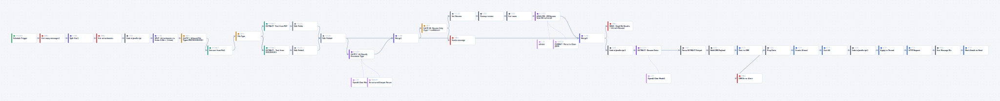

# Resume Scanner — n8n AI Intake Workflow

A 44-node n8n workflow that turns a recruiting firm's email inbox into a structured,
AI-scored candidate pipeline. It's the front door of the [Recruiting CRM](../recruiting-crm/):
resumes arrive by email, and scored candidates appear in the CRM minutes later.

## The workflow, node for node

The full canvas, rendered from this repo's workflow JSON at the nodes' real editor positions
(dashed lines are the LLM/parser sub-node attachments). Click to open full size and zoom:

To explore it interactively, import `resume-scanner.json` into any n8n instance
(*Workflows → Import from File*).

## Pipeline, stage by stage

1. **Ingest** — a schedule trigger polls Gmail, pulls unread applications, splits out
   attachments so each file becomes its own work item.
2. **Gate 1: file type** — only PDF/DOC/DOCX pass; a switch routes each format to its own
   text-extraction path, re-merged into a common shape.
3. **Gate 2: is it a resume?** — an LLM classifier (structured output, with confidence)
   rejects cover letters, references, and junk before any expensive analysis runs; rejects
   trigger a notification email instead.
4. **Analyze** — the resume text is cleaned and scored by OpenAI o4-mini against the firm's
   evaluation framework: structured summary, skills, tier, and fit score.
5. **Deliver** — results are emailed to the recruiter with the resume attached, and a second
   structured-extraction pass builds the CRM payload posted to `/api/intake/candidate`
   (create-if-new dedup logic; failures fire a CRM error alert).
6. **Bookkeep** — processed threads are labeled and marked read, so re-runs are idempotent
   and nothing is double-handled.

## Engineering notes

- **Idempotent by design** — Gmail labels + thread tracking make re-runs safe.
- **Credentialed, not hardcoded** — API keys live in n8n credentials, not workflow JSON
  (moved off an earlier inline-key setup as part of production hardening).
- **Paired-item correctness** — n8n's item-pairing semantics across merge/split nodes were a
  real source of subtle bugs; the workflow includes fixes for those paths.
- `import-resumate.ts` — the one-off TypeScript script that migrated the firm's legacy ATS
  export into the CRM at cutover.

## Status

Live and in daily use by the client.

> **Note:** this export is sanitized — the client's production endpoints and addresses are
> replaced with `example.com` placeholders, and no credentials are embedded (API keys live in
> n8n credentials, referenced by ID only). The workflow file is `resume-scanner.json`.
